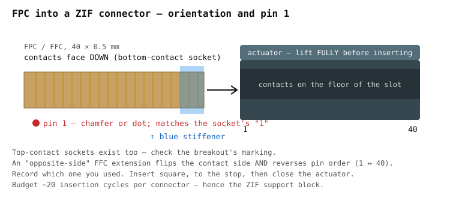

# Assembly guide

Step-by-step for the **Rev A perfboard** build. Rev B (PCB) replaces Phase 2 with
"solder the board" and is covered in [`docs/hardware/pcb.md`](docs/hardware/pcb.md).

Read first: [`docs/hardware/components.md`](docs/hardware/components.md) for every part,
[`hardware/wiring/wiring_diagram.md`](hardware/wiring/wiring_diagram.md) for the GPIO table.

---

## Phase 1 — FPC pinout discovery (mandatory, do first)

The keyboard FPC has 40 lines; which are matrix, power, backlight, power button and
(possibly) TrackPoint is established by measurement. **Do not wire anything to the Pico
until this phase is recorded in `hardware/pinout/`.**

Full procedure: [`hardware/pinout/probing_procedure.md`](hardware/pinout/probing_procedure.md).
Summary:

1. **Keyboard matrix.** FPC into the 40-pin ZIF breakout (check contact side — see the
   picture below). Pico with CircuitPython, `tools/matrix_probe/matrix_probe.py` as
   `code.py`, 115200 baud. Two passes cover 40 pads on 26 GPIO. Press every key; the
   script prints the (drive, sense) pad pair per key as a Markdown table.
2. **Non-matrix pins.** GND by continuity to the cable's shield; VCC by 3.3 V through
   100 Ω; backlight pair by a faint glow at 3.3 V through 100 Ω (backlit variants only);
   power button by continuity when pressed.
3. **Three-key test.** Hold A + S + D. No phantom key ⇒ the membrane has diodes ⇒ no
   1N4148s needed.
4. **ClickPad.** Its FPC into the small breakout. Find VCC/GND (the Synaptics draws
   ~10–15 mA when correctly powered). 4.7 kΩ pull-ups on the candidate CLK/DATA pins;
   `tools/ps2_sniffer/ps2_sniffer.py` finds the pair and runs the Synaptics identify.
5. **TrackPoint route.** With the sniffer running, push the stick with **no finger on the
   pad**. Pass-through frames (`W == 3`) ⇒ the TrackPoint rides the ClickPad bus and needs
   no wiring. No frames ⇒ find its own CLK/DATA on the keyboard FPC; they go to GP20/GP19.
6. **Record** everything in `hardware/pinout/x240_keyboard_fpc_pinout.md` and
   `hardware/pinout/x240_clickpad_fpc_pinout.md`.




*Photo-style illustration only; the drawing is the reference.*

---

## Phase 2 — Rev A perfboard

### 2.1 Board

Stripboard ≈100 × 80 mm. Lay out: ZIF breakouts along the front edge (toward the deck's
cable exits), three DIP-16 sockets in a row behind them, the 2 × 20 Pico socket at the rear
edge with USB facing out. Break strips under the DIPs and sockets. Drill four M2 holes on
the sled pattern ([`docs/enclosure/printed.md`](docs/enclosure/printed.md)) — or, for the
hand-made E1 route, to match three of the X240 base cover's standoffs.

### 2.2 Sense chain

Per [`docs/hardware/shift-register-matrix.md`](docs/hardware/shift-register-matrix.md):

- U1–U3 `74HC165` in sockets. `VCC` → 3V3 with 100 nF to GND at each chip. `CE` → GND.
- `PL` of all three → GP17. `CP` of all three → GP18.
- U1 `Q7` → GP16. U2 `Q7` → U1 `DS`. U3 `Q7` → U2 `DS`. U3 `DS` → GND.
- One 9-pin 10 kΩ bussed SIP per chip: common pin → 3V3, the eight others → `D0`–`D7`.
- Sense lines from the keyboard breakout → `D0`–`D7` of U1, U2, U3 in order (S0 = U1.D0).

Run `tools/shift_register_test/` **before** connecting the keyboard: ground each `Dn` in
turn and confirm the matching bit.

### 2.3 Drive lines

Keyboard breakout drive pads → GP0 … GP9 directly. Use a different wire colour from the
sense lines.

### 2.4 PS/2

```
3V3  ── ClickPad VCC        GND ── ClickPad GND
GP21 ── ClickPad DATA  + 4.7 kΩ to 3V3
GP22 ── ClickPad CLK   + 4.7 kΩ to 3V3
```

DATA on GP21 and CLK on GP22 — not the other way. The RP2040 PIO driver requires
clock = data + 1.

### 2.5 Backlight (backlit keyboards only)

```
3V3 ── R_series ── strip (+)     strip (−) ── Q1 drain     Q1 source ── GND
GP26 ── 10 kΩ ── Q1 gate         Q1 gate ── 100 kΩ ── GND
```

Measure strip current first and pick R_series:
[`docs/hardware/backlight.md`](docs/hardware/backlight.md).

### 2.6 Power button, LED, reset

```
Power-button FPC pin ── GP27         (internal pull-up; firmware guard 500 ms)
GP28 ── 100 Ω ── LED (+)   LED (−) ── GND
RUN ── tactile switch ── GND
```

### 2.7 Pre-power check

Work through the checklist at the end of
[`hardware/wiring/wiring_diagram.md`](hardware/wiring/wiring_diagram.md). Only then plug in.

---

## Phase 3 — Firmware

```bash
pip install qmk && qmk setup
cp -r firmware/qmk/keyboards/x240_pico ~/qmk_firmware/keyboards/x240_pico
# set matrix size and regenerate LAYOUT/keymap from Phase 1 (milestone M4 tooling)
qmk compile -kb x240_pico -km default
qmk flash   -kb x240_pico -km default       # hold BOOTSEL while plugging in
```

Configuration reference: [`docs/firmware/qmk-configuration.md`](docs/firmware/qmk-configuration.md).
Pointing-stack bring-up and tuning: [`docs/firmware/pointing-stack.md`](docs/firmware/pointing-stack.md).

Test: every key in a text editor; an NKRO tester with 10+ keys; ClickPad move and corner
clicks; **stick moves the cursor with no finger on the pad**; FN + F1 mute, FN + F11
backlight, FN + Esc FN Lock; power button ≥ 500 ms. With `CONSOLE_ENABLE = yes`,
`qmk console` must show the Synaptics identify succeeding — not the fallback line.

---

## Phase 4 — Enclosure

Pick one:

- **Printed** — [`docs/enclosure/printed.md`](docs/enclosure/printed.md). Measure the
  deck, update `cad/params.scad`, print the two case halves and the small parts, dry-fit.
- **Hand-made** — [`docs/enclosure/handmade.md`](docs/enclosure/handmade.md). E1 (reuse
  the X240 base cover) needs a screwdriver and a rotary tool and no measuring.

Fit and routing rules for both: [`docs/enclosure/integration.md`](docs/enclosure/integration.md).

---

## Phase 5 — Final assembly

Follow the order in [`docs/enclosure/presentation.md`](docs/enclosure/presentation.md):
bench-test open → prepare enclosure → strain relief and guides → mount board → ClickPad
FPC → keyboard FFC → re-test beside the deck → lay deck on, check the seam with a torch →
screw down star-pattern, hand-tight → gasket, feet, light pipe → test on three OSes →
flash the release firmware.

---

## Troubleshooting

| Symptom | Likely cause | Fix |
|---|---|---|
| No USB device | Not powered, wrong `.uf2`, or firmware doesn't build yet (pre-M4) | Check cable; reflash; see `docs/firmware/architecture.md` |
| Random keys with nothing pressed | A sense input floating | SIP common pin not on 3V3, or a missing network |
| Keys shifted by 8 / stuck pattern | Chain order or PL/CP swapped | Re-check 2.2 with the self-test |
| Some keys missing / wrong | Keymap mismatch | Regenerate from Phase 1 data |
| Ghost keys with three held | No membrane diodes | Add 1N4148 per sense line at the breakout |
| Touchpad dead | DATA/CLK swapped | DATA = GP21, CLK = GP22 |
| Touchpad works, TrackPoint dead | Identify failed → relative fallback | `qmk console` shows the fallback line; check init timing; confirm `W == 3` frames in the sniffer |
| Touchpad very slow / fast | Scale constant | `SYN_TOUCHPAD_SCALE` |
| Backlight always off | MOSFET pinout | Check *that* part's datasheet |
| Backlight always on | No gate pull-down | Add 100 kΩ gate → GND |
| Backlight won't build | Driver | `BACKLIGHT_DRIVER = software` on RP2040 |
| Power button instant | Guard | Check `matrix_scan_kb()` and `POWER_BUTTON_HOLD_MS` |
