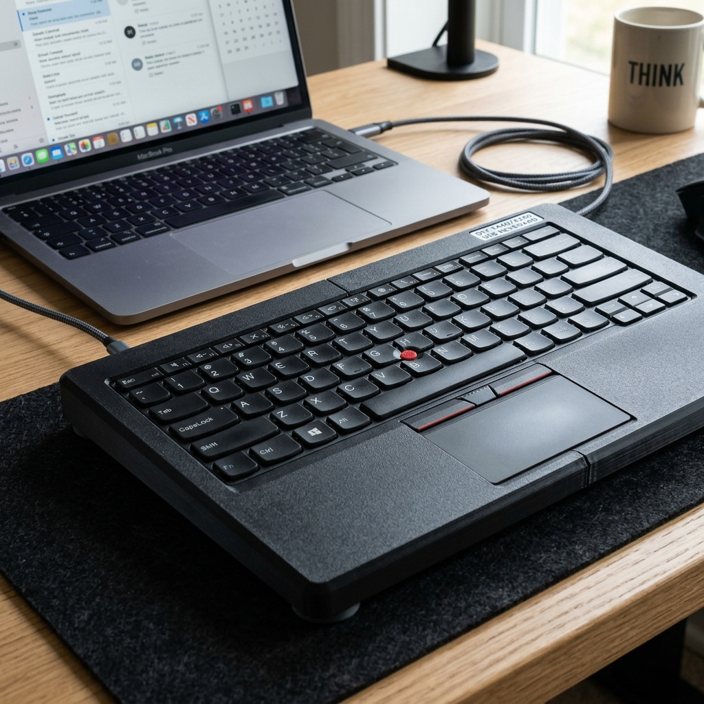
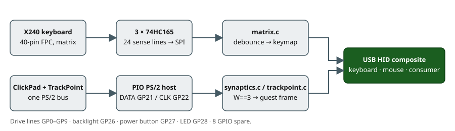

# x240-kbd

A standalone USB keyboard with touchpad **and TrackPoint**, built from a ThinkPad X240
keyboard assembly (FRU 0C44020) and its Synaptics ClickPad, driven by a Raspberry Pi Pico
(RP2040) running QMK.

Works on **any OS without drivers** — it enumerates as a standard USB HID composite device
(keyboard + mouse + media keys).



> **Project status: design, not yet built.** The matrix pinout is unverified until the
> probing step runs on real hardware, and the TrackPoint route (via the ClickPad's PS/2
> pass-through) is the expected architecture, confirmed by the same step. Everything else
> here is designed to survive either answer. Track progress in the
> [issues](https://github.com/nikolareljin/x240-kbd/issues) — nine milestones from
> documentation to release.

---

## Features

- Full 84-key ThinkPad X240 layout (QWERTY, US)
- Synaptics ClickPad — cursor, left/right click zones
- **TrackPoint** — via the ClickPad's pass-through port, decoded in firmware
- FN layer with the ThinkPad media/system keys; FN Lock (FN + Esc)
- Keyboard backlight, 5 levels (backlit keyboard variants; no breathing — software PWM)
- Power button with a 500 ms long-press guard → OS power/sleep
- Touchpad indicator LED
- N-Key Rollover
- Micro-USB; documented USB-C upgrade
- Two enclosure routes: **3D-printed** (split case) or **hand-made with no printer**
- Two electronics revisions: **Rev A perfboard** and **Rev B KiCad PCB**, same firmware

---

## Hardware at a glance

| Component | Detail |
|---|---|
| Controller | Raspberry Pi Pico, RP2040, 26 GPIO |
| Keyboard | X240 0C44020, 40-pin 0.5 mm FPC; matrix size **measured by probing** |
| Sense expansion | 3 × 74HC165 shift registers — 24 sense lines on 3 GPIO |
| Touchpad + TrackPoint | Synaptics ClickPad, PS/2 on GP21/GP22 (RP2040 PIO driver) |
| Backlight | LED strip via 2N7002/BS170 MOSFET on GP26 |
| Power button | GP27, active LOW |
| USB | Micro-USB; USB-C via the Pico's TP1/TP2/TP3 pads |
| Enclosure | Printed split case, or the original X240 base cover, laser-cut plates, a Hammond console or wood |



Why a shift register: the closest documented ThinkPad keyboard of this era needs 26 matrix
lines — every GPIO the Pico has. [`docs/hardware/gpio-budget.md`](docs/hardware/gpio-budget.md).

### Cost

| Build | All-in (USD, Aug 2026) |
|---|---|
| Rev A + your own printer | **$90–130** |
| Rev A + reused X240 base cover, no printer | **$110–150** |
| Rev B PCB | add $25–35 |

The donor keyboard and palmrest are most of it. Full tiers and part links:
[`docs/hardware/bom-and-cost.md`](docs/hardware/bom-and-cost.md).

---

## Repository structure

```
x240-kbd/
├── firmware/qmk/keyboards/x240_pico/   QMK keyboard definition (corrected in milestone M4)
├── hardware/pinout/                     FPC pin maps — filled by probing
├── hardware/wiring/                     GPIO table (the single authoritative copy) and schematics
├── hardware/pcb/                        Rev B KiCad project (milestone M7)
├── tools/matrix_probe/                  CircuitPython matrix discovery
├── tools/ps2_sniffer/                   CircuitPython PS/2 + Synaptics sniffer
├── cad/                                 OpenSCAD: split case and small printed parts
└── docs/                                The documentation site (GitHub Pages from /docs)
    ├── hardware/                        components, BOM & cost, GPIO budget, sense chain, TrackPoint, backlight, PCB
    ├── firmware/                        architecture, QMK configuration, pointing stack
    ├── enclosure/                       printed, hand-made, integration, durability, presentation
    ├── references.md · glossary.md
    └── images/
```

---

## Quick start

Everything runs through one entry point, `./dev` (verbs from the workspace-wide
[script-helpers](https://github.com/nikolareljin/script-helpers) template; toolchains in
Docker, so the host needs only `docker`, `git` and `python3`):

```bash
./dev install            # submodules, docker images, a shallow qmk_firmware checkout
./dev build [firmware|docs|tools|cad|pcb|all]
./dev test               # host pytest for the tools, link check, shellcheck
./dev preflight          # everything CI runs: test + build all
./dev deploy             # copy the UF2 to the Pico's RPI-RP2 drive  (alias: ./flash)
./dev deploy matrix_probe   # copy a probing tool to CIRCUITPY        (alias: ./probe <tool>)
./dev devices            # RPI-RP2 / CIRCUITPY mounts and serial ports
./dev logs               # qmk console — the firmware's debug output
```

Shims `./build`, `./test`, `./flash`, `./probe`, `./site` wrap the same verbs. Artifacts
land in `out/`. The Docker images and the `qmk_firmware` commit are **pinned by digest**
in `scripts/toolchain.env` (`scripts/pull_toolchain.sh` pulls, saves or refreshes them),
so today's build can be repeated later. CI (`.github/workflows/ci.yml`, via
[ci-helpers](https://github.com/nikolareljin/ci-helpers)) runs `./dev test` and
`./dev build all` on every push and PR.

1. **Read the component reference and buy parts** —
   [`docs/hardware/components.md`](docs/hardware/components.md),
   [`docs/hardware/bom-and-cost.md`](docs/hardware/bom-and-cost.md).
2. **Probe the FPC pinouts — mandatory first step.** Flash CircuitPython, `./probe
   matrix_probe`, then `./probe ps2_sniffer`, following
   [`hardware/pinout/probing_procedure.md`](hardware/pinout/probing_procedure.md). Do not
   wire the Pico to anything before this is done.
3. **Build the Rev A adapter** — [`ASSEMBLY.md`](ASSEMBLY.md) Phase 2, using
   [`hardware/wiring/wiring_diagram.md`](hardware/wiring/wiring_diagram.md).
4. **Build and flash firmware** — `./dev build` then `./dev deploy` (hold BOOTSEL while
   plugging in). Without `./dev`: copy `firmware/qmk/keyboards/x240_pico` into a QMK
   checkout and `qmk compile -kb x240_pico -km default`. The firmware **builds** (custom
   74HC165 matrix, PIO PS/2 host, Synaptics + TrackPoint decoding); the key map is a
   placeholder until probing (#38). [`docs/firmware/qmk-configuration.md`](docs/firmware/qmk-configuration.md).
5. **Choose an enclosure** — printed:
   [`docs/enclosure/printed.md`](docs/enclosure/printed.md); no printer:
   [`docs/enclosure/handmade.md`](docs/enclosure/handmade.md).
6. **Close it up** — [`docs/enclosure/presentation.md`](docs/enclosure/presentation.md)
   has the assembly order.

---

## FN key map

| FN + | Action | | FN + | Action |
|---|---|---|---|---|
| F1 | Mute | | F9 | Settings |
| F2 | Volume down | | F10 | Bluetooth |
| F3 | Volume up | | F11 | **Backlight step** |
| F4 | Mic mute (F20) | | F12 | Print Screen |
| F5 | Brightness down | | PgUp / PgDn | Home / End |
| F6 | Brightness up | | Left / Right | Previous / next track |
| F7 | External display | | Esc | **FN Lock** |
| F8 | Wireless toggle | | | |

---

## USB-C upgrade (optional)

Wire a USB-C female breakout (one with 5.1 kΩ CC pull-downs) to the pads on the Pico's
underside:

| Pico pad | Signal | Breakout |
|---|---|---|
| **TP1** | **GND** | GND |
| **TP2** | **USB D−** | D− |
| **TP3** | **USB D+** | D+ |
| VBUS (pin 40) | 5 V | VBUS |

Set `usb_c = true` in `cad/bottom_case.scad` for the USB-C cutout. No firmware change.


> The illustration [`docs/images/usb_c_wiring.png`](docs/images/usb_c_wiring.png) is
> decorative; its pad labels predate this table and are **not** the wiring reference.
> Source: [Pico datasheet, test points](https://datasheets.raspberrypi.com/pico/pico-datasheet.pdf).

Alternatively use a **Pimoroni Pico LiPo** (USB-C native, same pinout).

---

## Flashing

- **First flash:** hold BOOTSEL while plugging in → `RPI-RP2` drive → drag the `.uf2`.
- **After that:** `./dev deploy`, or hold the top-left key (Esc) while plugging in (Bootmagic).
- **Recommended:** wire a tactile switch to the Pico's `RUN` pad, reachable through the
  case, so BOOTSEL + reset works without opening anything.

---

## Documentation

The site is built from `docs/` (GitHub Pages, milestone M1). Start at
[`docs/README.md`](docs/README.md). Builder guides: [`ASSEMBLY.md`](ASSEMBLY.md),
[`PLAN.md`](PLAN.md). Changes: [`CHANGELOG.md`](CHANGELOG.md).

## References

Annotated list in [`docs/references.md`](docs/references.md). The projects this one stands
on: [delingren/thinkpad_keyboards](https://github.com/delingren/thinkpad_keyboards),
[hamishcoleman/thinkpad-usbkb](https://github.com/hamishcoleman/thinkpad-usbkb),
[thedalles77/USB_Laptop_Keyboard_Controller](https://github.com/thedalles77/USB_Laptop_Keyboard_Controller).

## Repository

[nikolareljin/x240-kbd](https://github.com/nikolareljin/x240-kbd) · GPL-2.0, matching QMK.

## Clone traffic


_Updated daily. Total and unique cloners over the last 14 days._
