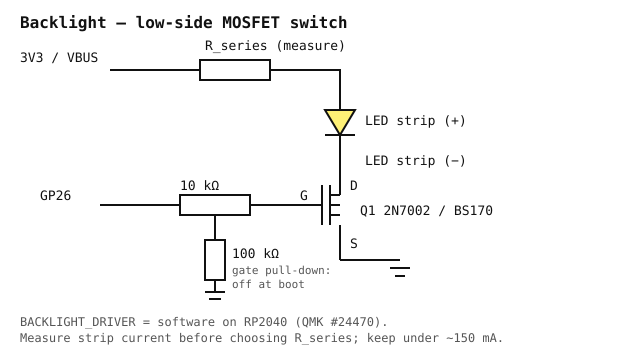

# Keyboard backlight

Only the backlit keyboard variants (`04X0177`, `0C43982`) have an LED strip. The
non-backlit `0C44020` has none — on that keyboard the circuit below is simply left
unpopulated and `BACKLIGHT_ENABLE = no`.

## Circuit



A low-side N-MOSFET switch on GP26. The Pico cannot source the strip's current directly
(GPIO limit ~12 mA; the strip is ~100 mA on comparable ThinkPad arrays).

```
3V3 ──── R_series ──── LED strip anode (+)
                        LED strip cathode (−) ──── Drain
                                                   Source ──── GND
GP26 ──── 10 kΩ ──── Gate
                     Gate ──── 100 kΩ ──── GND
```

| Part | Value | Why |
|---|---|---|
| Q1 | 2N7002 (SOT-23) or BS170 (TO-92) | Logic-level V<sub>GS(th)</sub>, turns on fully at 3.3 V |
| R<sub>gate</sub> | 10 kΩ | Limits the gate-charge current spike on each PWM edge |
| R<sub>pd</sub> | 100 kΩ gate → GND | Holds the gate LOW while the Pico boots and GP26 is high-Z: **the backlight does not flash at power-on** |
| R<sub>series</sub> | 100 Ω to start — **set by measurement** | The strip has its own internal resistors on most ThinkPads; measure before trusting any value |
| Supply | 3V3 from the Pico | If the strip is dim at 3.3 V, move the anode to VBUS (5 V) and re-measure current |

## Measure before you trust it

1. Identify the backlight anode/cathode pins on the keyboard FPC (Phase 1).
2. With the MOSFET **not** fitted, put a multimeter in series and apply 3.3 V through 100 Ω.
3. Note the current. Expect tens of mA; delingren measured ~5.6 mA per LED × 18 LEDs ≈
   100 mA on a 04Y0819 with no series resistor.
4. If it is under ~20 mA and visibly dim, reduce R<sub>series</sub> or move to 5 V.
   If it is over ~150 mA, raise R<sub>series</sub>. The USB budget is 500 mA total; keep
   the backlight under a third of that.
5. Record the final values in this file.

## QMK driver selection

This is where the earlier plan was wrong.

| Driver | What it is | RP2040? |
|---|---|---|
| `pwm` | Hardware PWM via ChibiOS `PWMD` | **Fails to compile on RP2040** — [QMK #24470](https://github.com/qmk/qmk_firmware/issues/24470): `unknown type name 'PWMConfig'`, undeclared `PWMD4` |
| `timer` | Interrupt-driven pin toggling | Documented for **AVR and STM32**; not the RP2040 workaround |
| `software` | PWM emulated in the main loop | **Works on RP2040** — the workaround recorded in #24470 |
| `custom` | You write it | Unnecessary here |

So: `BACKLIGHT_DRIVER = software`. The cost is some flicker sensitivity if the scan loop
stalls; at our ~350 µs scan this is invisible. If a later QMK release fixes RP2040 `pwm`,
switch and record it in `CHANGELOG.md`.

Reference: [QMK backlight docs](https://docs.qmk.fm/features/backlight).

## Configuration

```c
/* config.h */
#define BACKLIGHT_PIN     GP26
#define BACKLIGHT_LEVELS  5
#define BACKLIGHT_BREATHING
#define BREATHING_PERIOD  6
```

```make
# rules.mk
BACKLIGHT_ENABLE = yes
BACKLIGHT_DRIVER = software
```

FN + F11 (`CK_BKLT`) steps through the five levels; breathing is toggled with the standard
`BL_BRTG` keycode if mapped.

## Troubleshooting

| Symptom | Cause |
|---|---|
| Always off | Gate/drain/source mixed up (TO-92 pinout varies by manufacturer — check the datasheet, not the package shape) |
| Always on, even before firmware | Missing 100 kΩ pull-down |
| On but no dimming | Driver is not `software`, or `BACKLIGHT_LEVELS` is 1 |
| Dim | R<sub>series</sub> too high for 3.3 V — measure, then consider 5 V |
