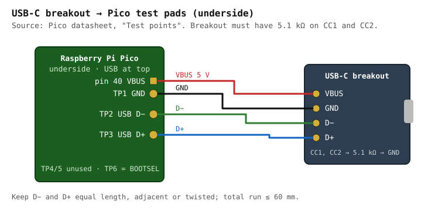

# Component reference

Every chip, connector, cable, tool and consumable used anywhere in this build, with the
document that specifies it and at least one place to buy it. If a part is mentioned in
another file and missing here, that is a bug in this file.

Prices are in [`bom-and-cost.md`](bom-and-cost.md). Wiring is in
[`../../hardware/wiring/wiring_diagram.md`](../../hardware/wiring/wiring_diagram.md).

---

## Controller

### Raspberry Pi Pico (RP2040)

| | |
|---|---|
| Role | USB HID controller: scans the matrix, hosts the PS/2 bus, drives backlight and LED |
| Package | 51 × 21 mm module, 2 × 20 castellated 0.1" header, Micro-USB |
| Exposed GPIO | 26 — GP0–GP22 and GP26–GP28 |
| Datasheet | [Pico datasheet](https://datasheets.raspberrypi.com/pico/pico-datasheet.pdf) · [RP2040 datasheet](https://datasheets.raspberrypi.com/rp2040/rp2040-datasheet.pdf) |
| Buy | [raspberrypi.com](https://www.raspberrypi.com/products/raspberry-pi-pico/) · Adafruit · Pimoroni · DigiKey |
| Why | Cheapest board with a PIO block, which is what makes a hardware PS/2 host possible in QMK on this family; QMK's RP2040 platform support is mature. |

**USB test pads on the underside** — used by the optional USB-C upgrade:

| Pad | Signal |
|---|---|
| TP1 | **GND** |
| TP2 | **USB DM (D−)** |
| TP3 | **USB DP (D+)** |
| TP4 | GPIO23 / SMPS mode — do not use |
| TP5 | GPIO25 / LED — do not use |
| TP6 | BOOTSEL |

Earlier revisions of this repo said TP1 = D− and TP2 = D+. That is wrong and would short
ground onto D−; see [CHANGELOG](../../CHANGELOG.md).

**Pico 2 (RP2350)** is pin-compatible and $1 more. Before substituting it, confirm QMK's
RP2350 support for the PS/2 PIO driver in the QMK version you are building with.

**Why not a bigger board?** The pin budget is solved with a shift register instead — see
[`gpio-budget.md`](gpio-budget.md).

---

## Logic

### 74HC165 — 8-bit parallel-in / serial-out shift register

| | |
|---|---|
| Role | Sense-line expander. Three cascaded devices read 24 matrix sense lines through 3 GPIO. |
| Part | Rev A: `SN74HC165N` (DIP-16). Rev B: `SN74HC165DBR` / `74HC165PW` (SSOP/TSSOP). |
| Supply | 2.0–6.0 V — runs at 3.3 V in spec |
| Datasheet | [Nexperia 74HC_HCT165](https://assets.nexperia.com/documents/data-sheet/74HC_HCT165.pdf) · [TI SN74HC165](https://www.ti.com/lit/ds/symlink/sn74hc165.pdf) |
| Buy | [DigiKey SN74HC165N](https://www.digikey.com/en/products/detail/texas-instruments/SN74HC165N/376966) · [DigiKey SN74HC165DR](https://www.digikey.com/en/products/detail/texas-instruments/SN74HC165DR/377068) · Nexperia 74HC165D at LCSC |
| Why | Reads in parallel, shifts out serially over SPI; a 24-bit chain reads in ~3 µs. No I²C address setup, no driver dependency, and the inputs tolerate up to 15 V. |

Gotchas that matter here: **HC inputs have no internal pull-ups** — every D0–D7 input needs
an external pull-up or it floats and reads random keys. Tie `CE` LOW. Tie the first
device's `DS` to a defined level. Details in [`shift-register-matrix.md`](shift-register-matrix.md).

### 10 kΩ bussed SIP resistor network, 9-pin

| | |
|---|---|
| Role | Pull-ups for the 74HC165 sense inputs — one 8-resistor network per chip |
| Part | Bourns 4609X-101-103LF or generic `A09-103` (9-pin, 8 × 10 kΩ, common pin 1) |
| Buy | [Jameco SIP networks](https://www.jameco.com/c/Network-SIP-Resistors.html) · DigiKey · Amazon kits |
| Why | Three parts instead of twenty-four discrete resistors on a perfboard. Rev B uses 4 × 0603 arrays instead. |

---

## Discrete semiconductors

### 2N7002 / BS170 — N-channel MOSFET

| | |
|---|---|
| Role | Low-side switch for the keyboard backlight LED strip, gate driven by GP26 |
| Package | 2N7002 = SOT-23 (Rev B). BS170 = TO-92 (Rev A, hand-solderable) |
| Ratings | 60 V, ~200–500 mA continuous, VGS(th) ≈ 1–2.5 V — turns on fully from a 3.3 V GPIO |
| Datasheet | [2N7002 (Nexperia)](https://assets.nexperia.com/documents/data-sheet/2N7002.pdf) · [BS170 (onsemi)](https://www.onsemi.com/pdf/datasheet/bs170-d.pdf) |
| Why | Logic-level threshold, cheap, and the strip (~100 mA on comparable ThinkPad arrays) is far below its rating. |

### 1N4148 — signal diode

| | |
|---|---|
| Role | Anti-ghosting diodes, **only if** the Phase 1 three-key test shows the keyboard lacks them |
| Package | DO-35 |
| Datasheet | [1N4148 (Vishay)](https://www.vishay.com/docs/81857/1n4148.pdf) |
| Why | Most ThinkPad membranes already include diodes; buy a 100-pack only after the test says so. Note that `BOM.md` once called these "Schottky" — they are ordinary silicon signal diodes. |

### Touchpad indicator LED

| | |
|---|---|
| Role | Shows the pointing device is active; driven by GP28 through 100 Ω |
| Part | Any 3 mm or 0805 LED, ~2 V forward, ≤ 20 mA. The X240 palmrest may already have one on the ClickPad FPC — probing decides. |

---

## Connectors and cables

### Keyboard FPC — 40-pin, 0.5 mm pitch

The X240 keyboard (FRU 0C44020) terminates in a 40-conductor 0.5 mm pitch FPC. Which of the
40 lines are matrix, power, backlight and power-button is **not documented by Lenovo** and is
established by probing — see [`../../hardware/pinout/probing_procedure.md`](../../hardware/pinout/probing_procedure.md).

### 40-pin 0.5 mm FPC → DIP breakout **with ZIF connector** (Rev A)

| | |
|---|---|
| Role | Brings the keyboard FPC out to 0.1" pads on the perfboard |
| Buy | [Tinkersphere 40-pin 0.5/1 mm](https://tinkersphere.com/cables-wires/3608-40-pin-05mm-1mm-pitch-fpc-to-dip-breakout.html) · [Amazon 2-pack](https://www.amazon.com/40-Pin-Connector-Breakout-Board-0-5mm/dp/B00XSC2G4A) · [Crystalfontz (premium)](https://www.crystalfontz.com/product/cfabbcs050z40gb0-40-position-zif-breakout-board) |
| Check | **Contact side.** Breakouts come as top- or bottom-contact; the keyboard cable's contacts face one way. Buy a bottom-contact board or plan to use the FFC extension (below) to flip orientation. |

**About Adafruit #1436.** Earlier revisions of this repo listed it as "ZIF FPC to DIP
adapter". [Adafruit 1436](https://www.adafruit.com/product/1436) is a *multi-pitch
solder-pad adapter plate* — it has no ZIF connector. It works only if you solder a bare
FPC directly to it or fit your own connector. It is listed here so nobody buys it expecting a
socket.

### 8–12-pin 0.5 mm FPC → DIP breakout (Rev A)

| | |
|---|---|
| Role | Brings the ClickPad FPC out to 0.1" pads |
| Buy | [Tinkersphere 8-pin](https://tinkersphere.com/cables-wires/3616-8-pin-05mm-1mm-pitch-fpc-to-dip-breakout.html) · AliExpress 6/8/10/12-pin |
| Check | Pin count of the X240 ClickPad cable varies by revision — count yours before ordering. |

### 40-pin 0.5 mm FFC extension, 150 mm

| | |
|---|---|
| Role | Strain relief and orientation flip between the keyboard cable and the adapter inside the case |
| Buy | [BuyDisplay 150 mm 40-pin](https://www.buydisplay.com/150mm-length-40-pins-0-5mm-pitch-bottom-contact-ffc-fpc-flex-cable-4579) · DigiKey Molex/Würth FFC jumpers |
| Check | "Same-side" vs "opposite-side" contacts changes pin order (Type A vs Type D). Document which you bought in the pinout file. |

### Hirose FH12 0.5 mm ZIF connectors (Rev B PCB)

| | |
|---|---|
| Role | Board-mounted FPC sockets on the Rev B PCB |
| Parts | `FH12-40S-0.5SH(55)` — 40-pin bottom contact · `FH12-nnS-0.5SH(55)` for the ClickPad, `nn` from probing |
| Datasheet | [Hirose FH12 series](https://www.hirose.com/en/product/document?series=FH12&documenttype=Catalog&lang=en&documentid=D31648_en) |
| Buy | [DigiKey FH12-40S-0.5SH(55)](https://www.digikey.com/en/products/detail/hirose-electric-co-ltd/FH12-40S-0-5SH-55/1110328) · Mouser |
| Why | The de-facto standard 0.5 mm FPC socket; KiCad ships its footprint. |

### USB-C female breakout (optional)

| | |
|---|---|
| Role | USB-C port for the case, wired to the Pico's TP1/TP2/TP3 pads |
| Buy | Adafruit 4090 (USB-C breakout) · generic "USB-C female to 6-pin" boards with 5.1 kΩ CC pull-downs |
| Check | The breakout **must** have 5.1 kΩ on CC1 and CC2 or a USB-C host will not enable VBUS. |

---

## Donor parts

### ThinkPad X240 keyboard

| | |
|---|---|
| FRU | `0C44020` (US, non-backlit) · `04X0177` / `0C43982` (US, backlit) · `04Y0938` / `0C44711` (compatible X240/X250/X260 variants) |
| Contains | Key matrix, TrackPoint stick and its controller, power button, backlight on the backlit variants |
| Buy | [eBay 0C44020](https://www.ebay.com/itm/387219786805) · [Amazon compatible](https://www.amazon.com/Replacement-0C44711-04Y0938-Thinkpad-Keyboard/dp/B07WRK24XY) |
| Reference | [iFixit X240 keyboard replacement](https://www.ifixit.com/Guide/Lenovo+Thinkpad+X240+Keyboard+Replacement/118924) · [Lenovo X240 HMM](https://support.lenovo.com/us/en/manuals/um019141) |

### ThinkPad X240 palmrest with ClickPad

| | |
|---|---|
| FRU | `00HT393` (no fingerprint reader) · `00HT392` (with fingerprint reader) · touchpad alone `SM10A39149` |
| Contains | Synaptics ClickPad (PS/2), palmrest, touchpad bezel. Combined "palmrest + keyboard + touchpad" listings exist and are the simplest purchase. |
| Buy | [eBay 00HT393](https://www.ebay.com/p/1361311702) · [iFixit 00HT393](https://www.ifixit.com/products/00ht393-lenovo-thinkpad-x240-palmrest-touchpad-without-fpr) |

### ThinkPad X240 base cover (hand-made enclosure route E1)

| | |
|---|---|
| FRU | `04X5184` / `00HT389` / `0C64937` |
| Role | Reused as the bottom enclosure — it already mates to the palmrest with the stock bosses |
| Buy | [eBay 04X5184](https://www.ebay.com/itm/121981528885) · Newegg |

### Synaptics ClickPad (inside the palmrest)

Speaks **PS/2**, with a *pass-through (guest) port* that carries the TrackPoint's PS/2
stream inside Synaptics packets. Specification:
Synaptics *TouchPad Interfacing Guide* (PN 511-000275; no longer hosted publicly — the working reference is the Linux driver [`drivers/input/mouse/synaptics.c`](https://github.com/torvalds/linux/blob/master/drivers/input/mouse/synaptics.c)).
Architecture and packet formats in [`trackpoint.md`](trackpoint.md).

### TrackPoint controller (inside the keyboard)

Two-piece module family shared by T440/T450/T460/X240/X250/X260 — strain-gauge sensor
board plus a controller (TPM754-class) that outputs PS/2. Background:
[sharktastica TrackPoint wiki](https://sharktastica.co.uk/wiki/trackpoint) ·
[delingren/thinkpad_keyboards](https://github.com/delingren/thinkpad_keyboards) (04Y0819,
documents the reset-pulse requirement on a standalone module).

---

## Passives and hardware

| Part | Value | Role |
|---|---|---|
| Resistor | 4.7 kΩ ¼ W × 2 | PS/2 DATA/CLK pull-ups |
| Resistor | 10 kΩ ¼ W × 1 | MOSFET gate series |
| Resistor | 100 kΩ ¼ W × 1 | MOSFET gate pull-down (LED off during boot) |
| Resistor | 100 Ω ¼ W × 2 | Backlight series (value set by measurement), touchpad LED |
| Capacitor | 100 nF X7R × 6 | Decoupling — one per 74HC165, two near the Pico |
| Stripboard | ≈100 × 80 mm | Rev A adapter ([Vero stripboard](https://verotl.com/circuitboards/veroboards)) |
| Headers | 2 × 20-pin 0.1" female | Socket the Pico so it can be replaced |
| Standoffs | M2 × 6 mm brass + M2 screws | Board mounting |
| Heat-set inserts | M2 × 3 mm | Printed enclosure bosses |
| Wire | 30 AWG wire-wrap, several colours | Point-to-point on Rev A |
| Gasket | 1 mm self-adhesive craft foam | Seals the deck-to-case seam |
| Filament | PETG, ~150 g | Printed enclosure route |

---

## Tools

| Tool | Used for | Note |
|---|---|---|
| Digital calipers | Measuring the X240 deck, bosses, stack heights | 0.01 mm resolution is enough |
| Temperature-controlled soldering iron, fine tip | 0.5 mm pitch breakouts, SIP networks | Flux and magnification strongly advised at 0.5 mm |
| Multimeter | Continuity at the FPC, VCC identification, LED forward drop | Diode mode needed |
| 8-channel USB logic analyser | Seeing PS/2 CLK/DATA while identifying ClickPad pins | Cypress FX2 "Saleae clone" with [sigrok/PulseView](https://sigrok.org/wiki/PulseView) |
| Serial terminal | CircuitPython probe tools at 115200 baud | Thonny, PuTTY, `screen` |
| [OpenSCAD](https://openscad.org/) | Editing and exporting CAD | Free |
| [KiCad 8+](https://www.kicad.org/) | Rev B PCB | Free |
| 3D printer *or* hand tools | Enclosure — see [`../enclosure/printed.md`](../enclosure/printed.md) and [`../enclosure/handmade.md`](../enclosure/handmade.md) | |
