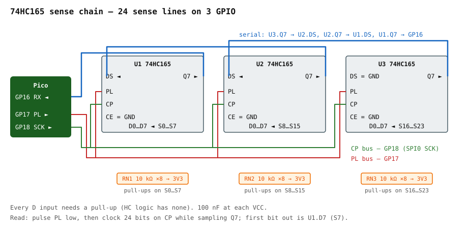

# 74HC165 sense-chain reference

Three cascaded 74HC165 shift registers read up to 24 matrix sense lines through three Pico
GPIO. This page is the electrical reference; the firmware side is in
[`../firmware/architecture.md`](../firmware/architecture.md).

Datasheet: [Nexperia 74HC_HCT165](https://assets.nexperia.com/documents/data-sheet/74HC_HCT165.pdf).

## How a 74HC165 works

- `PL` LOW → the eight inputs D0–D7 are loaded into the register **asynchronously**.
- `PL` HIGH → each rising edge on `CP` shifts the register one bit toward `Q7`, pulling a
  new bit in from `DS`.
- `CE` must be LOW for `CP` to do anything.
- `Q7` is the serial output; `DS` is the serial input from the previous device in a chain.

So one read is: pulse `PL` low, then clock 8 × *n* bits out while reading `Q7`.

## Chain schematic



```
                 Pico
   GP17 (PL)  ───┬─────────────────┬─────────────────┐
   GP18 (CP)  ──┬┼────────────────┬┼────────────────┐│
                ││                ││                ││
            ┌───┴┴────┐       ┌───┴┴────┐       ┌───┴┴────┐
            │ U1      │       │ U2      │       │ U3      │
   GP16 ◄───┤Q7     DS│◄──────┤Q7     DS│◄──────┤Q7     DS│◄── GND
            │ 74HC165 │       │ 74HC165 │       │ 74HC165 │
            │CE=GND   │       │CE=GND   │       │CE=GND   │
            │D0..D7   │       │D0..D7   │       │D0..D7   │
            └─┬┬┬┬┬┬┬┬┘       └─┬┬┬┬┬┬┬┬┘       └─┬┬┬┬┬┬┬┬┘
              S0 … S7           S8 … S15          S16 … S23      ← sense lines from FPC
              ││││││││          ││││││││          ││││││││
             [RN1 10k×8]       [RN2 10k×8]       [RN3 10k×8]     ← bussed SIP pull-ups
                 │                  │                  │
                3V3                3V3                3V3
```

Bit order on the wire: the **first** bit clocked out of `GP16` is U1's `D7` (S7), the last
is U3's `D0` (S16). Document the mapping once in firmware and never reason about it twice.

## Wiring rules

| Pin | Connection | Why |
|---|---|---|
| `VCC` | 3V3, with 100 nF to GND at each chip | HC logic, 2.0–6.0 V range |
| `CE` | GND on every device | clock enable must be LOW or nothing shifts |
| `DS` of U3 (last) | GND | defines the bits that shift in past the end of the chain |
| `D0–D7` | sense line **and** 10 kΩ pull-up to 3V3 | **no internal pull-ups** — floating inputs read random keys |
| `PL` | all three in parallel to GP17 | one latch pulse loads all 24 bits at once |
| `CP` | all three in parallel to GP18 | |
| `Q7` | U3 → U2 `DS`, U2 → U1 `DS`, U1 → GP16 | |

Use 9-pin bussed SIP networks (common pin to 3V3) — three parts instead of twenty-four
resistors on a stripboard. On the Rev B PCB these become 4 × 0603 arrays.

## Scan sequence

```
for each drive line Dk in GP0..GP9:
    set Dk LOW                        (others high-Z / high)
    wait MATRIX_IO_DELAY              (~30 µs; lets the pull-ups settle)
    PL LOW for ≥ 100 ns, then HIGH    (latch all 24 sense inputs)
    clock 24 bits over SPI0, MSB first, reading GP16
    release Dk
    row[k] = ~bits & mask             (a pressed key reads LOW)
```

Timing from the datasheet at 3.3 V is generous: `PL` pulse width min ~25 ns, `CP` up to
~30 MHz. SPI0 at 8 MHz has ~4× margin. Full scan ≈ 350 µs for 10 drive lines.

## Failure modes and what they look like

| Symptom | Cause |
|---|---|
| Random keys with nothing pressed | A sense input is floating — missing pull-up, or the SIP network's common pin is not on 3V3 |
| Every key reads as the same column, or a stuck pattern | `PL` and `CP` swapped, or `CE` left floating |
| Keys appear shifted by 8 | Chain order assumption wrong — U1/U3 `Q7` → `DS` crossed |
| Whole chain dead | `CE` not grounded, or `DS` of the last device floating and reading as bits |
| Keys work but ghost with three held | Not a chain problem — the membrane lacks diodes. See Phase 1 |

The [`tools/shift_register_test/`](../../tools/) CircuitPython script (M2) exercises the
chain with nothing else connected: ground each sense input in turn and watch the bit
position light up.

## Why not the 74HC595

The 595 is the *output* counterpart (serial-in, parallel-out). It would expand the **drive**
side instead. We have 10 spare drive GPIO and the chain only needs to expand sensing, so a
165 is the right part. If probing finds a transposed matrix, the chain moves to whichever
side is larger — still 165s, still sensing.
