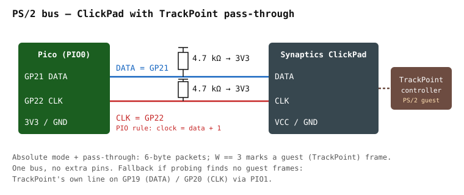

# TrackPoint architecture

The X240 keyboard has a TrackPoint. Earlier revisions of this project did not mention it.
It is a first-class feature: the finished keyboard must move the cursor from the stick and
click from the ClickPad's button zones.

## How the X240 routes the TrackPoint



In this generation of ThinkPads the TrackPoint does **not** have its own line to the host.
The stick's strain-gauge board feeds a controller (TPM754-class) that speaks PS/2, and that
PS/2 stream goes into the **Synaptics ClickPad's guest port**. The ClickPad forwards the
guest's packets to the host inside its own packet stream. Linux shows this as
`serio: Synaptics pass-through port` at boot.

```
TrackPoint strain gauges
   → TrackPoint controller  (PS/2 out, inside the keyboard)
      → ClickPad Synaptics guest port  (inside the palmrest)
         → ONE PS/2 bus  →  Pico GP21 (DATA) / GP22 (CLK)
```

Consequence: **no extra wires or pins**. The Pico sees one PS/2 device. Everything else is
firmware.

This is the *expected* chain. It is confirmed by the M2 ClickPad probing step — the extended
sniffer reports whether pass-through frames appear when the stick is pushed. Do not wire
for the fallback until that measurement says so.

## What QMK does and does not do

QMK's `ps2_mouse` feature speaks **plain PS/2 relative mode**: 3-byte packets, X/Y deltas,
three buttons. In that mode a Synaptics ClickPad behaves like an ordinary PS/2 mouse and
**silently drops** the guest stream — the TrackPoint is dead.

So the firmware does not use `ps2_mouse` at all. It keeps QMK's RP2040 PIO PS/2 *host*
(`PS2_ENABLE = yes`, `PS2_DRIVER = vendor`) and implements the pointing device itself
(`POINTING_DEVICE_DRIVER = custom`): put the ClickPad into Synaptics **absolute mode with
pass-through enabled**, then decode the 6-byte packets. That is `synaptics.c` /
`trackpoint.c` — [`../firmware/pointing-stack.md`](../firmware/pointing-stack.md).

## The Synaptics protocol, briefly

Spec: Synaptics *TouchPad Interfacing Guide* (PN 511-000275; no longer hosted publicly — the working reference is the Linux driver [`drivers/input/mouse/synaptics.c`](https://github.com/torvalds/linux/blob/master/drivers/input/mouse/synaptics.c)).
The Linux `psmouse` driver (`drivers/input/mouse/synaptics.c`) is the working reference
implementation.

**Identify ("magic knock").** Send `SetResolution` four times with the value encoding a
query number, then `StatusRequest` (`0xE9`); the three status bytes carry the answer. Query
`0x00` returns identification — byte 1 must be `0x47` for a Synaptics device.

**Mode byte.** Written with the same knock followed by `SetSampleRate 0x14`. Bits we set:
`Absolute` (bit 7), `Rate 80` (bit 6), `W-mode` (bit 0). Pass-through is enabled per the
guide's "extended capabilities" sequence when capability bit `PassThrough` is present.

**Absolute packet (6 bytes).**

```
byte 0: 1 0 W3 W2 0 W1 R L
byte 1: Y11 Y10 Y9 Y8 X11 X10 X9 X8
byte 2: Z7..Z0
byte 3: 1 1 Y12 X12 0 W0 R' L'
byte 4: X7..X0
byte 5: Y7..Y0
```

`W` (four bits) is the finger-width / packet-type field. **`W == 3` means this packet is a
pass-through frame**: bytes 1, 4 and 5 hold the guest device's standard 3-byte PS/2 packet
(buttons/sign byte, X delta, Y delta). Everything else is touchpad data.

So the decoder is one `switch` on `W`: guest frame → TrackPoint path; anything else →
touchpad path.

## Fallback: a standalone TrackPoint line

If the sniffer never sees `W == 3` frames with the stick deflected, the TrackPoint is not on
the ClickPad's guest port on this unit. Then:

- Find the TrackPoint controller's own CLK/DATA on the keyboard FPC (it will be two of the
  non-matrix pins), with 4.7 kΩ pull-ups.
- Wire them to the reserved pair **GP19 (DATA) / GP20 (CLK)**.
- Run a second PS/2 instance on PIO1 (`#define PS2_PIO_USE_PIO1`) — QMK's vendor driver
  uses PIO0 by default.
- A standalone controller may need its **reset pin pulsed high at boot**; delingren found a
  04Y0819 module failed ~90 % of the time without it. Probe for a reset line if the module
  is unreliable.

This path costs 2 GPIO and a second driver instance. It is documented so that the pins are
already reserved; it is not built until a measurement demands it.

## Buttons

The X240 ClickPad has no separate physical buttons; its top edge is a button zone for the
TrackPoint and its bottom corners are the touchpad's click zones. Those clicks arrive in the
**touchpad** packet's L/R bits, not in the guest frame. The firmware merges them: a click
while the last motion came from the stick is a TrackPoint click in practice, and the user
will not notice the distinction.
