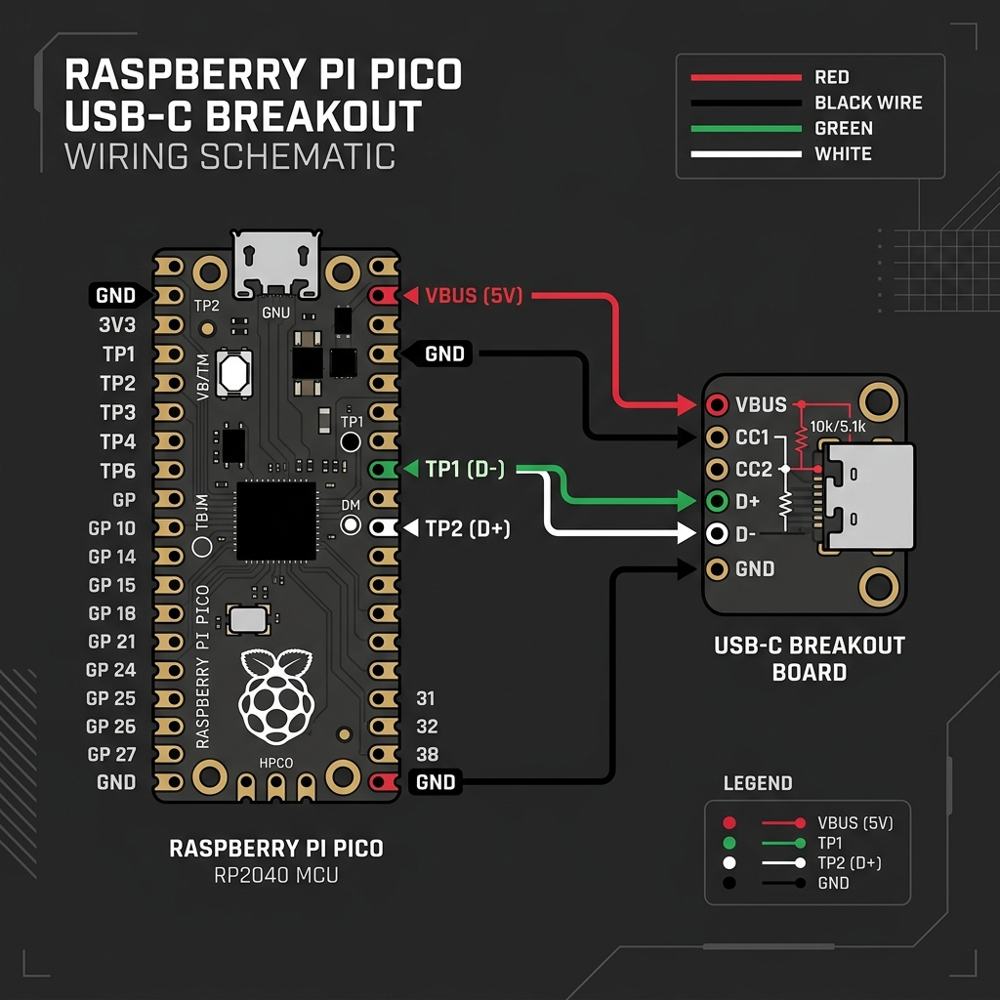
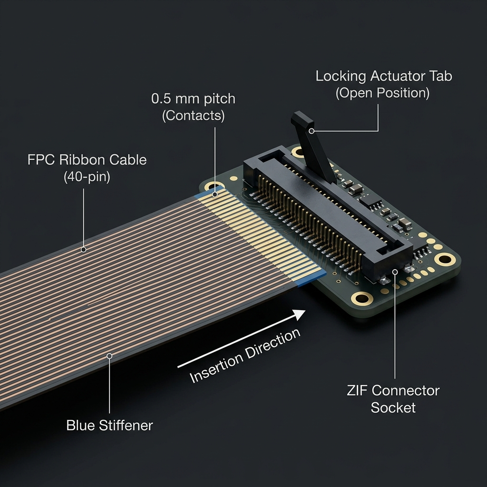

# Wiring reference

**This file is the single authoritative copy of the GPIO allocation.** Every other document
links here. If a page elsewhere disagrees with this table, this table wins and that page has
a bug.

---

## GPIO allocation

| Pico GPIO | Header pin | Function | Direction | Notes |
|---|---|---|---|---|
| GP0 | 1 | Matrix drive D0 | Output | Driven LOW one at a time during scan |
| GP1 | 2 | Matrix drive D1 | Output | |
| GP2 | 4 | Matrix drive D2 | Output | |
| GP3 | 5 | Matrix drive D3 | Output | |
| GP4 | 6 | Matrix drive D4 | Output | |
| GP5 | 7 | Matrix drive D5 | Output | |
| GP6 | 9 | Matrix drive D6 | Output | |
| GP7 | 10 | Matrix drive D7 | Output | |
| GP8 | 11 | Matrix drive D8 | Output | |
| GP9 | 12 | Matrix drive D9 | Output | Ten drive lines; documented ThinkPad matrices need ≤ 9 on one side |
| GP10–GP15 | 14–20 | **Spare** | — | |
| GP16 | 21 | Sense chain serial out ← 74HC165 U1 `Q7` | Input | SPI0 RX (MISO) |
| GP17 | 22 | Sense chain `PL` | Output | Parallel load, active LOW; plain GPIO |
| GP18 | 24 | Sense chain `CP` | Output | SPI0 SCK |
| GP19 | 25 | **Reserved** — PS/2 #2 DATA | — | Only if probing shows a standalone TrackPoint |
| GP20 | 26 | **Reserved** — PS/2 #2 CLK | — | Pair with GP19 (clock = data + 1) |
| GP21 | 27 | PS/2 **DATA** — ClickPad (+ TrackPoint pass-through) | Bidir | 4.7 kΩ pull-up to 3V3 |
| GP22 | 29 | PS/2 **CLK** — ClickPad | Bidir | 4.7 kΩ pull-up to 3V3. PIO driver rule: CLK = DATA + 1 |
| GP26 | 31 | Backlight MOSFET gate | Output | `software` PWM; 10 kΩ series, 100 kΩ pull-down |
| GP27 | 32 | Power button | Input | Internal pull-up; active LOW; 500 ms guard in firmware |
| GP28 | 34 | Touchpad LED | Output | HIGH = on, via 100 Ω |
| 3V3 | 36 | 3.3 V rail | Supply | 74HC165 × 3, SIP pull-ups, PS/2 pull-ups, ClickPad |
| GND | 3, 8, 13, 18, 23, 28, 33, 38 | Ground | Supply | |
| VBUS | 40 | 5 V from USB | Supply | Optional backlight anode supply |
| RUN | 30 | Reset | Input | Tactile switch to GND, reachable through the case |

*Header pin = physical pin on the Pico's 40-pin header.*

Pico underside test pads — used only by the USB-C upgrade:

| Pad | Signal |
|---|---|
| TP1 | GND |
| TP2 | USB D− |
| TP3 | USB D+ |

---

## Schematics

### Matrix and 74HC165 sense chain

```
 Keyboard FPC (40-pin, via ZIF breakout) — pin numbers filled after probing
 ┌──────────────────────────────────────────────────────────────────────────┐
 │ drive lines ────────────────────────────────► GP0 … GP9 (one per line)    │
 │ sense lines S0…S23 ──┐                                                    │
 └──────────────────────┼───────────────────────────────────────────────────┘
                        │          3V3
                        │           │
                        │      [RN1][RN2][RN3]  10 kΩ × 8 bussed SIP, one per chip
                        │           │
          ┌─────────────┴───────────┴──────────┐
          │  U1 74HC165      U2 74HC165      U3 74HC165                       │
          │  D0-D7 ← S0-S7   D0-D7 ← S8-S15  D0-D7 ← S16-S23                 │
          │  PL ◄────────────┬───────────────┬────────────────── GP17 (PL)   │
          │  CP ◄────────────┬───────────────┬────────────────── GP18 (SCK)  │
          │  Q7 ──► GP16     Q7 ──► U1.DS    Q7 ──► U2.DS     U3.DS ── GND   │
          │  CE ── GND       CE ── GND       CE ── GND                        │
          │  VCC 3V3 + 100 nF each                                            │
          └──────────────────────────────────────────────────────────────────┘
```

Read sequence, bit order and failure modes:
[`docs/hardware/shift-register-matrix.md`](../../docs/hardware/shift-register-matrix.md).

### PS/2 — ClickPad (carries the TrackPoint)

```
 3V3 ─────────────── ClickPad VCC
 GND ─────────────── ClickPad GND
 GP21 ─┬─ 4.7 kΩ ─ 3V3
       └──────────── ClickPad DATA
 GP22 ─┬─ 4.7 kΩ ─ 3V3
       └──────────── ClickPad CLK
 GP28 ── 100 Ω ───── LED anode   (LED cathode ── GND; or the ClickPad FPC's own LED pins)
```

The TrackPoint's PS/2 stream rides inside the ClickPad's packets (Synaptics pass-through).
No extra wires. If probing disproves that on your unit, the TrackPoint's own CLK/DATA go to
GP20/GP19 with the same pull-ups — see
[`docs/hardware/trackpoint.md`](../../docs/hardware/trackpoint.md).

### Backlight (backlit keyboard variants only)

```
 3V3 (or VBUS) ── R_series ── LED strip (+)
                              LED strip (−) ── Drain  Q1 2N7002 / BS170
                                               Source ── GND
 GP26 ── 10 kΩ ── Gate
                  Gate ── 100 kΩ ── GND        (off during boot)
```

R_series is set by measurement: [`docs/hardware/backlight.md`](../../docs/hardware/backlight.md).

### Power button

```
 GP27 ──────────── power-button FPC pin     (other side of the switch → GND)
 Pico internal pull-up keeps GP27 HIGH; pressed = LOW; firmware requires ≥ 500 ms hold
```

### Reset

```
 RUN (pin 30) ── tactile switch ── GND
```

### USB-C breakout (optional)

```
 Pico TP1 (GND) ──── breakout GND
 Pico TP2 (D−)  ──── breakout D−
 Pico TP3 (D+)  ──── breakout D+
 Pico VBUS      ──── breakout VBUS       breakout must have 5.1 kΩ on CC1 and CC2
```



*Decorative. The labels in the image predate the TP1/TP2/TP3 correction; the text above is
the reference.*

### FPC to ZIF breakout



*Illustrative. Check your breakout's contact side (top vs bottom) against the cable.*

---

## Keyboard FPC → breakout → Pico / chain

Fill after probing (`hardware/pinout/x240_keyboard_fpc_pinout.md` is the master copy).

| Signal | FPC pin | Breakout pad | Destination |
|---|---|---|---|
| Drive D0 … D9 | | | GP0 … GP9 |
| Sense S0 … S7 | | | U1 D0 … D7 |
| Sense S8 … S15 | | | U2 D0 … D7 |
| Sense S16 … S23 | | | U3 D0 … D7 |
| GND | | | GND |
| VCC | | | 3V3 |
| Backlight + / − | | | R_series / Q1 drain |
| Power button | | | GP27 |
| TrackPoint CLK / DATA (only if standalone) | | | GP20 / GP19 |

## Rev A pre-power checklist

- [ ] Every FPC pad has continuity to exactly one destination
- [ ] No continuity between adjacent FPC pads (0.5 mm pitch — check every pair)
- [ ] 3V3 to GND: no short
- [ ] Each 74HC165: `CE` to GND, `VCC` to 3V3, 100 nF present
- [ ] SIP network common pin on 3V3
- [ ] PS/2 pull-ups present; DATA on GP21, CLK on GP22
- [ ] MOSFET pinout verified against *its* datasheet (TO-92 pinouts differ by maker)
